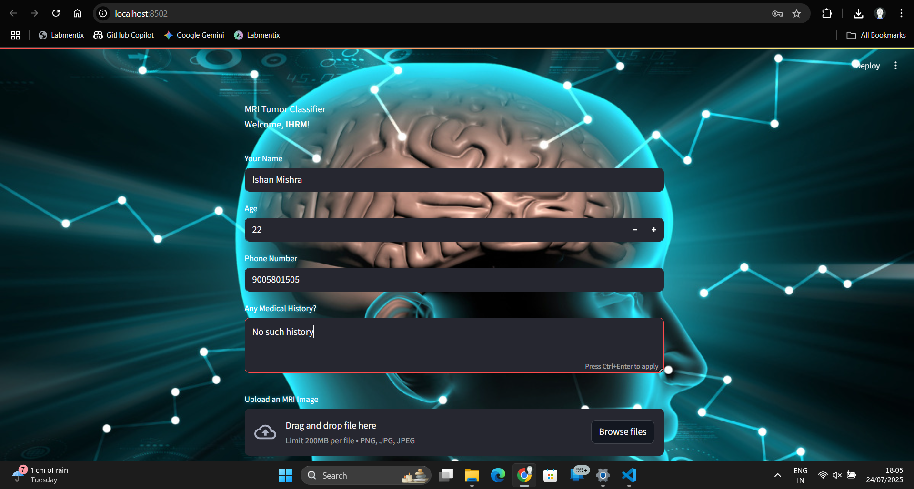
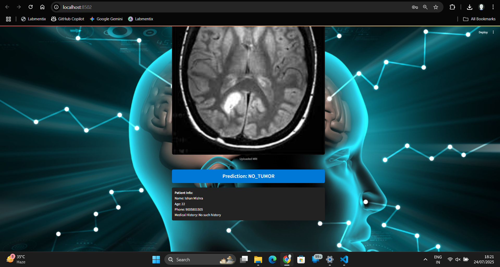

# Brain Tumor Classifier

A web application for automatic brain tumor detection from MRI images using deep learning, built with Streamlit.

---

## 🧠 Project Overview

Brain Tumor Classifier is a machine learning project designed to classify MRI brain images and detect potential tumors. It integrates a trained neural network model with a user-friendly Streamlit web interface for easy uploads and instant predictions.

---

## 🚀 Features

- Upload and analyze MRI images for tumor detection.
- Deep learning model for automatic image classification.
- Secure user authentication (if enabled via `users.json`).
- Visual results with probability/confidence scores.
- Modular code structure for easy customization and extension.

---

## 📁 Directory Structure

```
.
|-- BrainTumorClassifier/
|-- Data/
|   `-- Tumour/
|       |-- README.dataset.txt
|       |-- test/
|       |-- train/
|       `-- valid/
|-- README.md
|-- app/
|   |-- app.py
|   |-- background.jpg
|   |-- users.json
|   `-- utils.py
|-- models/
|   `-- best_model.pth
|-- notebooks/
|   |-- eda.ipynb
|   `-- train_model.ipynb
|-- requirements.txt
|-- src/
`-- venv/
```

**Key folders:**
- `app/` – Streamlit app and utilities.
- `models/` – Trained PyTorch model weights.
- `notebooks/` – Data exploration and model training notebooks.
- `Data/Tumour/` – Dataset (remove or .gitignore for large files/production).
- `requirements.txt` – All dependencies.

---

## ⚙️ Installation & Setup

### 1. Clone the repository

```bash
git clone https://github.com/IHRM-AI/BrainTumorClassifier.git
cd BrainTumorClassifier
```

### 2. Create a virtual environment (Recommended)

```bash
python -m venv venv
source venv/bin/activate   # On Windows: venv\Scripts\activate
```

### 3. Install dependencies

```bash
pip install -r requirements.txt
```

### 4. Download/Place Model Weights

- Ensure `models/best_model.pth` exists. Replace with your own trained weights if needed.

### 5. Run the app locally

```bash
streamlit run app/app.py
```

---

## ☁️ Deploy on Streamlit Cloud

1. Push the repo to GitHub (excluding large files via `.gitignore`).
2. Go to [Streamlit Cloud](https://share.streamlit.io/) and connect your repo.
3. Set the main module to `app/app.py`.
4. Make sure all dependencies are in `requirements.txt`.

## Login Screenshot
)

## App UI Screenshot


## Prediction Output Screenshot

---

## 📝 Usage

- Launch the app.
- Sign in (if authentication is enabled).
- Upload an MRI image.
- View tumor detection results and confidence score.

---

## 🧑‍🔬 Model & Data

- Model: Custom-trained deep learning model (PyTorch, see `notebooks/train_model.ipynb`).
- Data: Place your MRI images in `Data/Tumour/` (train, test, valid splits).
- Model weights: `models/best_model.pth`.

---

## 🛠️ Troubleshooting / FAQ

- **App not running?**  
  - Check you’ve installed all dependencies.
  - Double-check Python version (3.10+ recommended).
- **Deployment errors on Streamlit Cloud?**  
  - Remove Windows-only packages like `pywin32` from `requirements.txt`.
  - Large files or folders (like `venv/`, `Data/`) should be in `.gitignore`.
- **Model not found?**  
  - Ensure `models/best_model.pth` exists and is accessible.

---

## 🤝 Contributing

Pull requests are welcome!  
Open issues for bugs or feature requests.

---

## 📫 Contact

- **Repo:** [github.com/IHRM-AI/BrainTumorClassifier](https://github.com/IHRM-AI/BrainTumorClassifier)
- **Maintainer:** Ishan @ IHRM-AI

---
